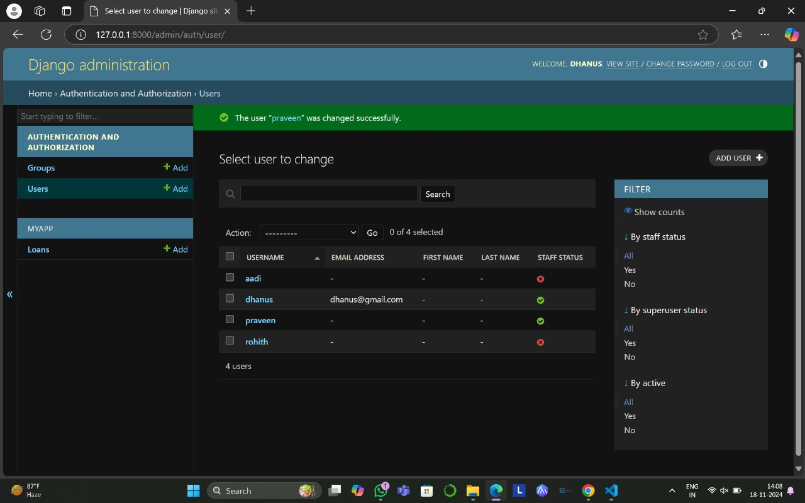
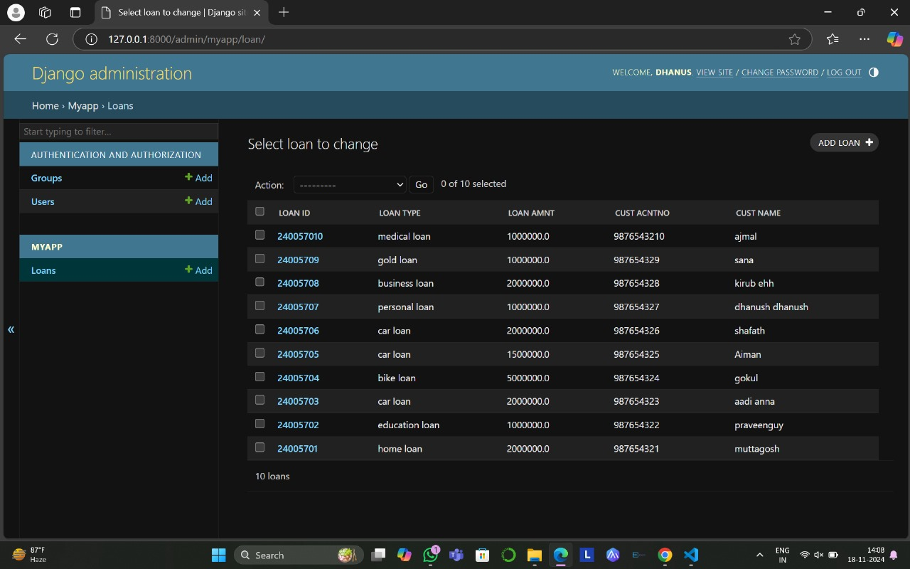

# Ex02 Django ORM Web Application
## Date: 

## AIM
To develop a Django application to store and retrieve data from a Bank database using Object Relational Mapping(ORM).

## Entity Relationship Diagram

## DESIGN STEPS

### STEP 1:
Clone the problem from GitHub

### STEP 2:
Create a new app in Django project

### STEP 3:
Enter the code for admin.py and models.py

### STEP 4:
Execute Django admin and create details for 10 customers.

## PROGRAM
'''
admin.py

class shad(admin.ModelAdmin);
        list_display = ('loan_id','loan_amt','cust_acno','cust_name')
'''
'''
models.py
class bankloan(models.Model);
    loan_id = models.IntegerField(primary_key=True)
    loan_type = models.Charfield(max_length=10)
    loan_amt = models.IntegerField
    cust_acno = models.IntegerField
    cust_name = models.CharField(max_length=50)
'''

## OUTPUT

## RESULT
Thus the program for creating a database using ORM hass been executed successfully
